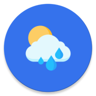

<p align="center">
  
</p>

<h1 align="center">Tempo — Weather Forecast & Smart Alerts</h1>

<p align="center">
  <b>Track real-time weather, explore 5-day forecasts, save favorite locations, and get scheduled alerts that keep you prepared.</b>
</p>

<p align="center">
  
  
  
  
  
  
</p>

---

## Table of Contents

- [About](#about)
- [Features](#features)
- [Architecture](#architecture)
- [Tech Stack](#tech-stack)
- [Project Structure](#project-structure)
- [Getting Started](#getting-started)
- [API Reference](#api-reference)
- [Permissions](#permissions)
- [Testing](#testing)
- [Contributing](#contributing)

---

## About

**Tempo** is a modern Android weather app built with **Kotlin** and **Jetpack Compose**.
It provides current weather conditions, detailed forecasts, favorite city management, map-based location picking, and smart scheduled weather alerts with configurable sound behavior.

The app uses **OpenWeather** as the remote data source, **Room** for local persistence, and **WorkManager** for reliable background alert scheduling.

---

## Features

### Weather & Forecast
- **Current Weather by Location** - Fetches weather based on the device location
- **5-Day Forecast** - Displays upcoming weather trends for better planning
- **Detailed Metrics** - Humidity, wind, pressure, cloud coverage, and more

### Favorites & Locations
- **Favorite Cities** - Save and manage frequently checked locations
- **Map Picker (OSMDroid)** - Select any city from an interactive map
- **Quick City Search** - Search and choose locations by name

### Alerts & Notifications
- **Scheduled Weather Alerts** - Create alerts with start/end date windows
- **Alert Types** - Rain, storm, temperature, and generic weather alerts
- **Snooze / Dismiss Flow** - Actionable full-screen alert experience
- **Notification Channels** - Supports silent and sound alert channels

### Settings & Personalization
- **Language Preferences** - Multi-language support flow
- **Theme Preferences** - User-selectable app appearance settings
- **Units Configuration** - Temperature and wind-speed unit options
- **Notification Controls** - Enable/disable notifications and alert sound

---

## Architecture

Tempo follows a **layered architecture** with clear separation between presentation, business models/contracts, and data sources:

```text
┌─────────────────────────────────────────────────────────────┐
│                      PRESENTATION                           │
│       Compose UI, Navigation, ViewModels, UI State          │
└────────────────────────────┬────────────────────────────────┘
                             │
┌────────────────────────────▼────────────────────────────────┐
│                         DOMAIN                              │
│      Models, Mappers, Repository Contracts, Settings        │
└────────────────────────────┬────────────────────────────────┘
                             │
┌────────────────────────────▼────────────────────────────────┐
│                          DATA                               │
│   Repository Implementations + Local/Remote Data Sources    │
└───────────────────┬───────────────────────┬─────────────────┘
                    │                       │
          ┌─────────▼─────────┐   ┌────────▼──────────────┐
          │       Room DB     │   │     Retrofit API      │
          │   Local storage   │   │ + OpenWeather service │
          └─────────┬─────────┘   └───────────────────────┘
                    │
          ┌─────────▼─────────┐
          │    WorkManager    │
          │   Alert jobs      │
          └───────────────────┘
```

### Navigation Flow

- `Home` -> current weather + quick forecast
- `Forecast` -> detailed weather for selected coordinates
- `Favorites` -> saved locations list
- `NewFav` -> map/search-based city selection
- `Notification` -> alert creation and management
- `Settings` -> language, units, location, notifications

---

## Tech Stack

| Layer | Technology |
|-------|------------|
| **Language** | Kotlin |
| **UI** | Jetpack Compose, Material 3 |
| **Navigation** | Navigation Compose 2.9.7 |
| **Architecture** | Layered (`presentation` / `domain` / `data`) |
| **Networking** | Retrofit 3.0.0, Gson Converter, OkHttp Interceptor |
| **Local Database** | Room 2.8.4 + KSP |
| **Background Jobs** | WorkManager 2.9.0 |
| **Location Services** | Google Play Services Location 21.3.0 |
| **Map Integration** | OSMDroid 6.1.16 |
| **Image Loading** | Coil 3.4.0, Glide 5.0.5 |
| **State & Async** | Kotlin Coroutines |
| **Testing** | JUnit4, kotlinx-coroutines-test, AndroidX tests |

---

## Project Structure

```text
app/src/main/java/iti/student/finalproject/
│
├── data/                           # Data layer implementation
│   ├── local/                      # Room DB, entities, DAOs, local data sources
│   ├── remote/                     # Retrofit APIs, DTOs, remote data sources
│   └── repository/                 # Repository implementation classes
│
├── domain/                         # Business contracts and models
│   ├── model/                      # Domain models
│   ├── mapper/                     # Mapper classes
│   └── repository/                 # Repository interfaces
│
├── presentation/                   # UI layer
│   ├── navigation/                 # Routes and NavGraph
│   ├── screen/                     # Compose screens + ViewModels
│   ├── components/                 # Shared composables
│   └── alarm/                      # Full-screen ringing alert activity
│
├── worker/                         # WorkManager workers and scheduling
├── utils/                          # Helper utilities
├── ui/theme/                       # App theme, colors, typography
├── MainActivity.kt                 # App entry activity
└── WeatherApp.kt                   # Application class
```

---

## Getting Started

### Prerequisites

- **Android Studio** (latest stable recommended)
- **JDK 11**
- **Android SDK 36**
- Emulator or real device with Android 7.0+ (API 24+)

### Installation

1. **Clone the repository**

   ```bash
   git clone https://github.com/your-username/FinalProject.git
   cd FinalProject
   ```

2. **Open in Android Studio**
   - Let Gradle sync complete
   - Ensure SDK platform/API 36 is installed

3. **Run the app**
   - Select an emulator/device
   - Run the `app` module

### OpenWeather API Key

The app currently injects the API key from `RetrofitInstance`.

For production readiness, move the key to a secure source such as:
- `local.properties`
- CI/CD environment secret
- encrypted keystore-backed config

---

## API Reference

Tempo consumes weather data from [OpenWeather](https://openweathermap.org/api).

- **Base URL:** `https://api.openweathermap.org/`
- The app appends `appid` automatically via an OkHttp interceptor.

Common endpoints used in weather apps:
- Current weather by coordinates
- Forecast by coordinates
- City-based geocoding/search

---

## Permissions

The app requests:

- `INTERNET` - Remote weather API calls
- `ACCESS_NETWORK_STATE` - Network availability checks
- `ACCESS_FINE_LOCATION` - Current location weather retrieval
- `POST_NOTIFICATIONS` - Alert and scheduled notifications (Android 13+)

---

## Testing

### Unit Tests

```powershell
.\gradlew :app:testDebugUnitTest
```

### Instrumented Tests

```powershell
.\gradlew :app:connectedDebugAndroidTest
```

---

## Contributing

Contributions are welcome.

1. Fork the repository
2. Create a feature branch (`git checkout -b feature/your-feature`)
3. Commit your changes
4. Push to your branch
5. Open a Pull Request

---

<p align="center">
  Built with ❤️ using Kotlin & Jetpack Compose
</p>

